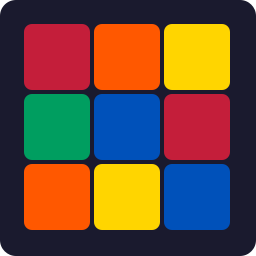

# Rubik's Tracker

A personal Rubik's cube solve tracker built with Electron, React, and TypeScript.



## Features

- ⏱️ **Timer** — track solve times with inspection countdown (WCA rules)
- 🧩 **Multi-cube support** — 2x2 through 7x7
- 📊 **Statistics** — Ao5, Ao12, Ao100, Mo3, best/worst, standard deviation
- 🏆 **Leaderboards** — personal bests across sessions
- 🔀 **Scramble visualization** — interactive 3D scrambles via `cubing.js`
- 💾 **Local storage** — SQLite database, your data stays on your machine

## Screenshots

<!-- TODO: Add screenshots of the timer, stats, and leaderboard pages -->

## Getting Started

```bash
# Install dependencies
npm install

# Run in development mode
npm run dev

# Run tests
npm test

# Build for Windows
npm run build:win
```

## Download

Grab the latest installer from the [Releases](https://github.com/cyberced21/rubiks-tracker/releases) page.

## Tech Stack

| Layer | Technology |
|-------|-----------|
| Shell | Electron + electron-vite |
| UI | React 18 + TypeScript |
| State | Zustand |
| Database | better-sqlite3 |
| Icons | Lucide React |
| Testing | Vitest |

## License

[MIT](LICENSE)
